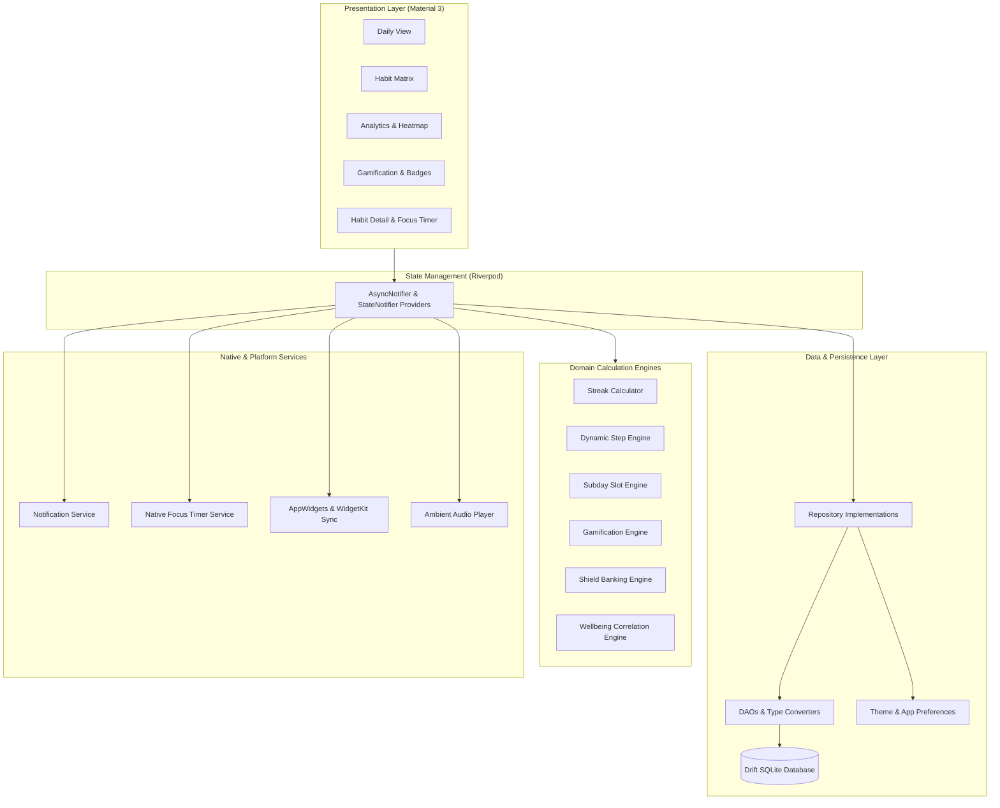
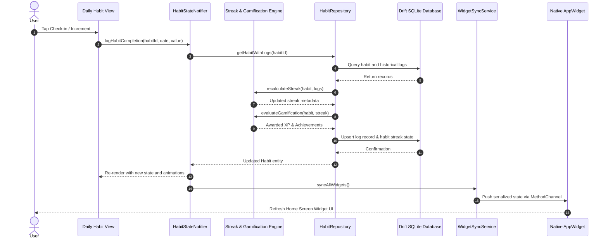

# Phial: Habit Tracker & Focus

Phial is an offline-first, high-performance habit tracking and focus companion built with Flutter, Riverpod, Drift persistence, and Material 3 design.

## Architecture Overview

Phial follows Clean Architecture principles with a reactive, unidirectional data flow. UI components observe domain state through Riverpod providers, while user interactions trigger repository methods that execute business logic engines and persist updates to a local Drift (SQLite) database. Platform channels bridge notifications, foreground timer services, and home screen widgets.



## Key Features

- Flexible Habit Models
  - Daily Habits: Continuous tracking with in-progress day preservation for unlogged current days
  - Weekly Habits: ISO Monday–Sunday boundary evaluation with week-unit streaks
  - Custom Schedules: Day-of-week target scheduling skipping non-target days without streak penalties
  - Stepper Habits: Dynamic magnitude-aware incrementation and quick-add chips
  - Subday Slot Habits: Multi-slot time-of-day tracking (Morning, Afternoon, Evening, Night)
  - Duration & Timers: Integrated focus countdowns and stopwatches with ambient audio
- Offline Gamification System
  - XP rewards based on habit completion and streak lengths
  - Streak multipliers and tiered player titles
  - Milestone and consistency achievement badges
- Analytics and Visualizations
  - Multi-year completion heatmaps and monthly performance matrices
  - Habit completion trends and wellbeing correlation analysis
- Platform Integrations
  - Native home screen widgets for Android (AppWidgets) and iOS (WidgetKit) with responsive layouts (2x2, 2x3, 2x4, 4x4) and scrollable interactive checklists
  - Rich notifications with action buttons for direct check-in
  - Foreground focus timer service with dynamic Do Not Disturb synchronization
- Data Portability & Secure Backups
  - Zero-knowledge AES-256-GCM client-side encrypted backups with PBKDF2 key derivation (100,000 iterations) and passkey generator
  - Plain JSON and Gzip-compressed (.json.gz) archives saving up to 90% storage
  - Deterministic sync merge engine with Last-Write-Wins (LWW) resolution and soft-delete tombstones
  - Standard RFC 4180 CSV export for external spreadsheet analysis
- Privacy First
  - Zero analytics, zero tracking, and fully offline SQLite local storage

## Tech Stack

| Layer / Concern            | Technology                    | Details                                               |
| -------------------------- | ----------------------------- | ----------------------------------------------------- |
| Language                   | Dart 3.13+                    | Sound null safety, functional patterns                |
| UI Framework               | Flutter 3.47+                 | Material 3, custom canvas charts                      |
| State Management           | Riverpod 2.6+                 | `AsyncNotifier`, `StateNotifier`, `ProviderContainer` |
| Local Database             | Drift 2.24+                   | SQLite with reactive streams, DAOs, schema migrations |
| Cryptography & Sync        | `cryptography` / `crypto`     | AES-256-GCM, PBKDF2-HMAC-SHA256, Gzip compression     |
| Native Android             | Kotlin / Gradle               | Jetpack Glance AppWidgets, Foreground Service         |
| Native iOS                 | Swift / WidgetKit             | Shared UserDefaults synchronization                   |
| Scheduling & Notifications | `flutter_local_notifications` | Timezone-aware local reminders                        |
| Audio                      | `audioplayers`                | Ambient focus sounds (White Noise, Rain, Cafe)        |
| Tooling                    | Make / build_runner           | Automated compilation, codegen, and testing pipelines |

## Project Structure

```text
habit-tracker-android/
├── lib/
│   ├── data/
│   │   ├── local/                      # Drift database, DAOs, schema tables, and converters
│   │   ├── preferences/                # SharedPreferences, theme, and user settings
│   │   ├── repositories/               # Concrete repository implementations
│   │   └── schedulers/                 # Reminder and rollover background schedulers
│   ├── di/                             # Riverpod dependency injection and provider definitions
│   ├── domain/
│   │   ├── engines/                    # Pure Dart computation engines (Streaks, Steppers, Slots)
│   │   ├── gamification/               # XP calculations, player titles, and achievement rules
│   │   ├── models/                     # Immutable domain entity models
│   │   └── repositories/               # Domain repository interfaces
│   ├── services/                       # Audio, DND, notifications, and native widget sync
│   ├── ui/                             # Material 3 screens, custom painters, and view models
│   └── main.dart                       # App entrypoint and startup initialization pipeline
├── android/                            # Android host project, Foreground Service, and AppWidgets
├── ios/                                # iOS host runner and WidgetKit extensions
├── test/                               # Comprehensive unit, widget, and calculation test suite
├── Makefile                            # Build, test, and emulator automation commands
├── pubspec.yaml                        # Flutter package dependencies and assets configuration
└── README.md                           # Project documentation
```

## Logic Flows

### Habit Check-In and Synchronization Flow

The following sequence diagram illustrates the lifecycle of a habit check-in, from user interaction through engine evaluation, database persistence, and native widget updates:



## Installation and Setup

### Prerequisites

- Flutter SDK version 3.47.0 or higher
- Dart SDK version 3.13.0 or higher
- Java Development Kit (JDK 17 or JDK 21)
- Android SDK with platform tools and API 34 installed

### Clone and Dependency Setup

```bash
# Clone the repository
git clone https://github.com/Hari31416/habit-tracker.git
cd habit-tracker-android

# Fetch Flutter dependencies
flutter pub get

# Generate Drift database code and Riverpod bindings
make codegen
```

### Running Automated Tests

```bash
# Run all unit, widget, and domain calculation engine tests
make test
```

### Code Quality and Analysis

```bash
# Run Flutter linter and static analysis
make lint
```

## Usage Examples

### Build and Launch on Android

```bash
# Complete automated pipeline (starts default emulator if needed, builds, installs, and launches)
make run

# Build debug APK directly
make build

# Stream live filtered application logs
make logcat
```

### Building Release Artifacts

Release builds require keystore configuration in `android/key.properties` or environment variables (`ANDROID_KEYSTORE_PATH`, `ANDROID_KEYSTORE_PASSWORD`, `ANDROID_KEY_ALIAS`, `ANDROID_KEY_PASSWORD`):

```bash
# Build release split-ABI APKs
make build-release

# Build release Android App Bundle (.aab)
make build-appbundle
```

### Managing Development Emulator

```bash
# List available Android Virtual Devices (AVDs)
make emulator-list

# Start emulator in background
make emulator-start AVD=Pixel_8_API_34

# Stop running emulator
make emulator-stop
```

## Privacy Policy

Phial operates completely offline. All habit entries, notes, analytics, and settings remain on the local device. For full privacy details, refer to [PRIVACY.md](PRIVACY.md).
