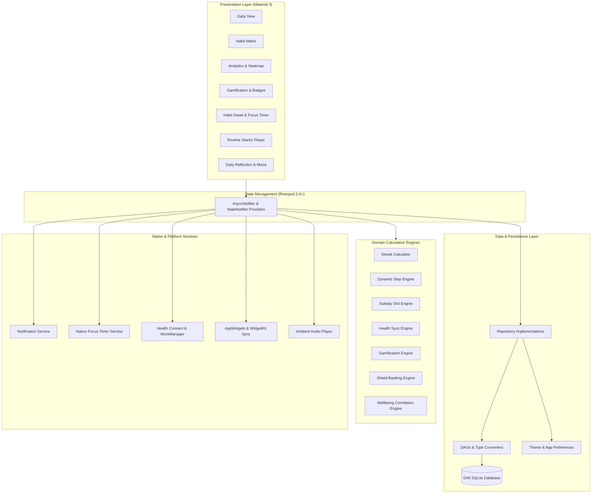
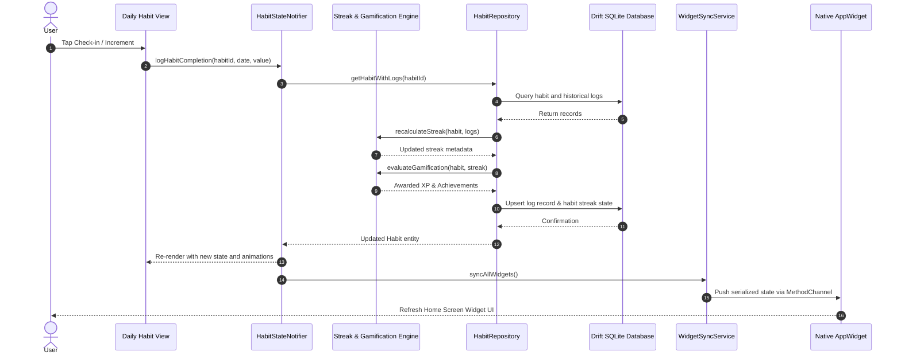
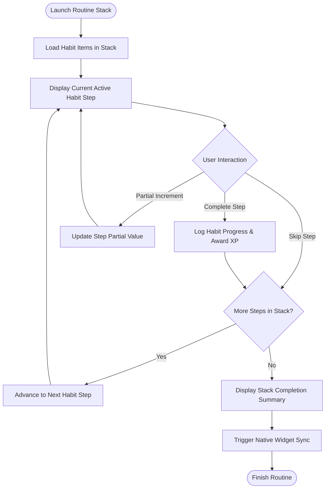

# Phial Habit Tracker and Focus

Phial is an offline-first, high-performance habit tracking and focus companion built with Flutter, Riverpod, Drift persistence, and Material 3 design. It combines flexible habit scheduling, routine stacking, elastic milestone targets, Google Health Connect telemetry, encrypted local backups, and native home screen widgets into a fully private, zero-telemetry utility.

## Architecture Overview

Phial follows Clean Architecture principles with a reactive, unidirectional data flow. Presentation components observe domain state through Riverpod providers, while user interactions trigger repository and service methods that execute business logic engines and persist updates to a local Drift (SQLite) database. Native platform channels bridge notifications, foreground timer services, Health Connect telemetry, and home screen widgets.



## Key Features

- Flexible Habit & Target Models
  - Daily Habits: Continuous tracking with in-progress chain preservation for unlogged current days
  - Weekly Habits: Canonical ISO Monday-Sunday week evaluation with week-unit streaks
  - Custom Schedules: Day-of-week target scheduling skipping non-target days without streak penalties
  - Interval Habits: Recurring interval rhythms (Every N Days) anchored to habit creation dates
  - Elastic Goals (Bad-Day Mode): Three-tiered milestone tracking (Mini, Base, Elite) preserving streak momentum on low-energy days with scaled XP (+5 XP Mini, +20 XP Base, +35 XP Elite)
  - Numeric Stepper Habits: Quantitative goals with customizable units (steps, pages, ml, km) and quick delta steppers
  - Sub-Day Time Slots: Multi-slot time-of-day tracking (Morning, Afternoon, Evening, Night) with discrete segment check-ins
  - Duration & Focus Timers: Integrated circular countdowns and stopwatches with ambient audio
  - Archived Habits Lifecycle: Dedicated filter chip, read-only safeguards, paused reminders, rollover exemption, and 1-tap instant restoration
- Habit Stacking Routines & Flow Execution
  - Sequential habit chaining ("After [Habit A], I will [Habit B]") for morning, evening, or custom productivity flows
  - Reorderable routine builder with drag-and-drop step sequencing, target time windows, color accents, and bonus XP rewards
  - Guided full-screen player with contextual transition cues, countdown/stopwatch controls, inline micro-reflections, and celebration summaries
- Abstinence Tracking & Sobriety Mode
  - Dedicated "Quit / Sobriety" goal type with custom clean start timestamps
  - Passive clean day tracking with live precision counter (Days, Hours, Minutes, Seconds)
  - Milestone progression badges (24 Hours, 3 Days, 1 Week, 1 Month, 3 Months, 6 Months, 1 Year)
  - Compassionate relapse reset dialog with optional trigger reflection logging
- Urge Surfer Mindfulness Tool
  - Science-backed 4-4-4-4 Box Breathing exercise (Inhale 4s, Hold 4s, Exhale 4s, Hold 4s)
  - Smooth expanding/contracting guidance ring, optional singing bowl audio chimes, sensory haptics, and 2-minute timer
  - Emergency craving grounding affirmations and psychological coping tips
- Reflections & Mindfulness
  - Post-check-in reflections with 5-point energy scale (1 Low to 5 Peak), mood tags, and 120-character micro-notes
  - Statistical Wellbeing Correlation Engine mapping habit consistency against subjective energy levels and mood
- Circular Focus Timer & Ambient Audio
  - Persistent background isolate with Android foreground service and lock-screen notification controls
  - Ambient soundscapes: Forest Birds, Gentle Rain, White Noise, and Cafe Ambience
  - Automatic Do Not Disturb (DND) mode synchronization during focus sessions
  - Quick delta steppers (+/- 5m, +/- 10m) and automatic duration logging to habit history
- Habit Shields & Streak Protection
  - Automatic shield banking (1 Habit Shield earned per 14 completed habit days)
  - Yesterday's missed habits protection, retroactive freeze application, and configurable max capacity
  - Automated midnight rollover worker (00:01) with auto-consume protection for active streaks at risk
- Offline Gamification & Progression
  - Base XP (+15 XP check-in, +1 XP/min focus, routine bonuses) amplified by active streak multipliers (1.0x to 2.0x)
  - Quadratic level progression curve (100 * Level^2 cumulative XP) across 5 titles (Novice, Apprentice, Adept, Pathfinder, Grandmaster)
  - 33 unlockable achievement badges across 7 distinct categories (Streak Milestones, Volume, Diversity, Routines, Perfect Days, Focus, Player Mastery)
- Comprehensive Analytics & Visualizations
  - 7-Day ISO Week Matrix with daily completion bar charts and quick long-press streak freeze toggles
  - Habit Detail screen with 10-dot progress milestone bars and all-time records
  - Multi-dimensional analytics: 30-day rolling consistency score, 7-day and 30-day adherence splines, and monthly density heatmaps
- Google Health Connect Integration
  - 7 Physical Health Metrics: Daily Steps, Active Exercise, Move Minutes, Distance, Active Calories, Hydration, and Sleep Duration
  - Zero-Touch Check-Ins: Automatic progress synchronization from Google Fit and wearable sensors
  - Automatic unit normalization and background WorkManager multi-day reconciliation
- Platform Integrations & Widgets
  - 4 High-DPI Native Android AppWidgets (2x2, 2x3, 2x4, 4x4): Daily Focus, Today's Habits Checklist (scrollable ListView), Streaks at Risk, and XP & Mastery
  - Dynamic launcher shortcuts for top pinned habits
  - Exact background reminder alarms (`exactAllowWhileIdle`) with actionable notifications (`Mark Done`, `+Delta Increment`, `View Habit`)
- Cryptographic Backups & Sync Merge
  - Zero-knowledge AES-256-GCM client-side encrypted backups with PBKDF2-HMAC-SHA256 (100,000 iterations), 128-bit salt, and random passkey generator
  - Plain JSON and Gzip-compressed (.json.gz) archives saving up to 90% storage
  - Deterministic sync merge engine with Last-Write-Wins (LWW) resolution and soft-delete tombstones
  - Standard RFC 4180 CSV export (`habits.csv`, `habit_logs.csv`)
- Privacy First
  - Zero analytics, zero advertising SDKs, and zero telemetry
  - 100% offline persistence in local SQLite database

## Tech Stack

| Layer / Concern            | Technology                    | Details                                               |
| -------------------------- | ----------------------------- | ----------------------------------------------------- |
| Language                   | Dart 3.13+                    | Sound null safety, functional and immutable patterns  |
| UI Framework               | Flutter 3.47+                 | Material 3 Design System, custom canvas charts        |
| State Management           | Riverpod 2.6+                 | `AsyncNotifier`, `StateNotifier`, `ProviderContainer` |
| Local Database             | Drift 2.24+                   | SQLite with reactive streams, DAOs, schema migrations |
| Health & Fitness           | `androidx.health.connect`     | Google Health Connect Android SDK, WorkManager        |
| Cryptography & Sync        | `cryptography` / `crypto`     | AES-256-GCM, PBKDF2-HMAC-SHA256, Gzip compression     |
| Native Android             | Kotlin / Gradle               | Jetpack Glance AppWidgets, Foreground Service         |
| Native iOS                 | Swift / WidgetKit             | Shared UserDefaults synchronization                   |
| Scheduling & Notifications | `flutter_local_notifications` | Timezone-aware local reminders                        |
| Audio                      | `audioplayers`                | Ambient focus sounds (White Noise, Rain, Cafe)        |
| UI Testing & Benchmarks    | Maestro / Python `uv`         | Declarative E2E flows, performance & frame benchmarks |
| Tooling                    | Make / build_runner           | Automated compilation, codegen, and testing pipelines |

## Project Structure

```text
habit-tracker-android/
├── lib/
│   ├── data/
│   │   ├── local/                      # Drift database, DAOs, schema tables, and converters
│   │   ├── preferences/                # SharedPreferences, theme, and user settings
│   │   ├── repositories/               # Concrete repository implementations
│   │   └── schedulers/                 # Reminder and rollover background schedulers
│   ├── di/                             # Riverpod dependency injection and provider definitions
│   ├── domain/
│   │   ├── engines/                    # Pure Dart calculation engines (Streaks, Steppers, Slots)
│   │   ├── gamification/               # XP calculations, player titles, and achievement rules
│   │   ├── models/                     # Immutable domain entity models
│   │   ├── repositories/               # Domain repository interfaces
│   │   ├── schedulers/                 # Domain notification and reminder models
│   │   └── sync/                       # Cryptographic backup and sync envelope engines
│   ├── services/                       # Audio, DND, notifications, and native widget sync
│   ├── ui/                             # Material 3 screens, custom painters, and view models
│   │   ├── analytics/                  # Heatmaps, trends, and wellbeing insights
│   │   ├── common/                     # Reusable widgets, cards, dialogs, and animations
│   │   ├── daily/                      # Primary daily habit checklist and filters
│   │   ├── detail/                     # Habit statistics, history logs, and timer controls
│   │   ├── form/                       # Habit creation and editing forms
│   │   ├── gamification/               # Levels, achievements, and player progress
│   │   ├── matrix/                     # Monthly matrix grid overview
│   │   ├── navigation/                 # Bottom navigation and screen scaffolding
│   │   ├── reflection/                 # Daily mood journaling and reflection inputs
│   │   ├── routines/                   # Routine stacks builder and player UI
│   │   ├── settings/                   # Backups, Health Connect, and theme configuration
│   │   └── theme/                      # Dynamic color palettes and typography
│   └── main.dart                       # App entrypoint and startup initialization pipeline
├── android/                            # Android host project, Foreground Service, and AppWidgets
├── ios/                                # iOS host runner and WidgetKit extensions
├── .maestro/                           # Declarative Maestro E2E test flows
├── scripts/                            # Benchmark runners, ADB tools, and test automation
├── test/                               # Comprehensive unit, widget, and calculation test suite
├── Makefile                            # Build, test, benchmark, and emulator automation commands
├── pubspec.yaml                        # Flutter package dependencies and assets configuration
└── README.md                           # Project documentation
```

## Logic Flows

### Habit Check-In and Synchronization Lifecycle

The following sequence diagram illustrates the lifecycle of a habit check-in, from user interaction through engine evaluation, database persistence, and native widget updates:



### Routine Stack Execution Flow

The following flowchart details how routine stacks sequentially progress through habits, record incremental progress, and finalize habit log state:



## Installation and Setup

### Prerequisites

- Flutter SDK version 3.47.0 or higher
- Dart SDK version 3.13.0 or higher
- Java Development Kit (JDK 17 or JDK 21)
- Android SDK with platform tools and API 34 installed

### Clone and Dependency Setup

```bash
# Clone the repository
git clone https://github.com/Hari31416/habit-tracker.git
cd habit-tracker-android

# Fetch Flutter dependencies
flutter pub get

# Generate Drift database code and Riverpod bindings
make codegen
```

### Git Hooks Installation

Install automated pre-commit (fast lint and unit tests) and pre-push (full test suite with coverage floor) hooks:

```bash
make install-hooks
```

### Running Automated Tests

```bash
# Run all unit, widget, and domain calculation engine tests
make test

# Fast verification gate (lint + tests)
make check-fast

# Full verification gate (lint + tests with coverage verification)
make check-full
```

### Code Quality and Static Analysis

```bash
# Run Flutter linter and static analysis
make lint
```

## Usage Examples

### Build and Launch on Android

```bash
# Complete automated pipeline (starts emulator if needed, builds, installs, and launches)
make run

# Build debug APK directly
make build

# Stream live filtered application logs
make logcat
```

### End-to-End UI Testing with Maestro

```bash
# Run smoke test flow
make maestro-smoke

# Run core CI subset flows
make maestro-ci

# Run full Maestro test suite
make maestro
```

### Performance Benchmarking

```bash
# Run automated Python benchmark suite measuring CPU, memory, and frame latency
make benchmark
```

### Building Release Artifacts

Release builds require keystore configuration in `android/key.properties`, `$(HOME)/keys/habit-tracker-release.credentials.txt`, or environment variables (`ANDROID_KEYSTORE_PATH`, `ANDROID_KEYSTORE_PASSWORD`, `ANDROID_KEY_ALIAS`, `ANDROID_KEY_PASSWORD`):

```bash
# Build release split-ABI APKs
make build-release

# Build release universal APK
make build-release-universal

# Build release Android App Bundle (.aab)
make build-appbundle
```

### Managing Development Emulator

```bash
# List available Android Virtual Devices (AVDs)
make emulator-list

# Start emulator in background
make emulator-start AVD=Pixel_8_API_34

# Stop running emulator
make emulator-stop
```

## Privacy and Data Security

Phial operates completely offline with zero telemetry, zero analytics tracking, and client-side encryption. All habit entries, notes, analytics, and settings remain strictly on the local device. For full privacy details, refer to [PRIVACY.md](PRIVACY.md).
