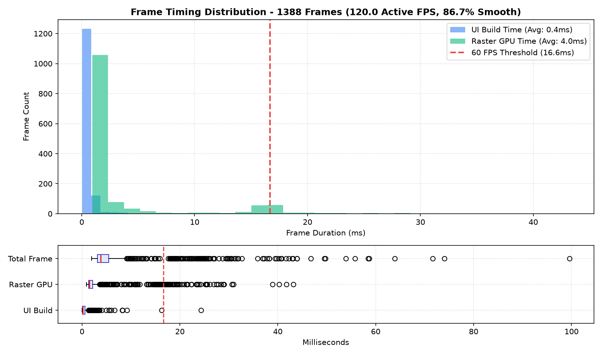
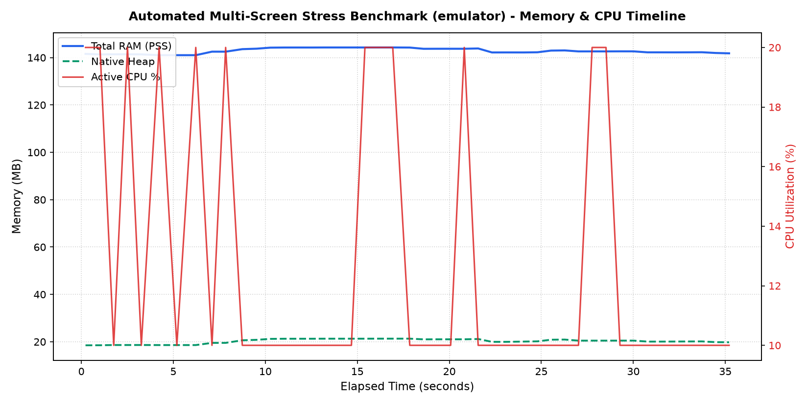
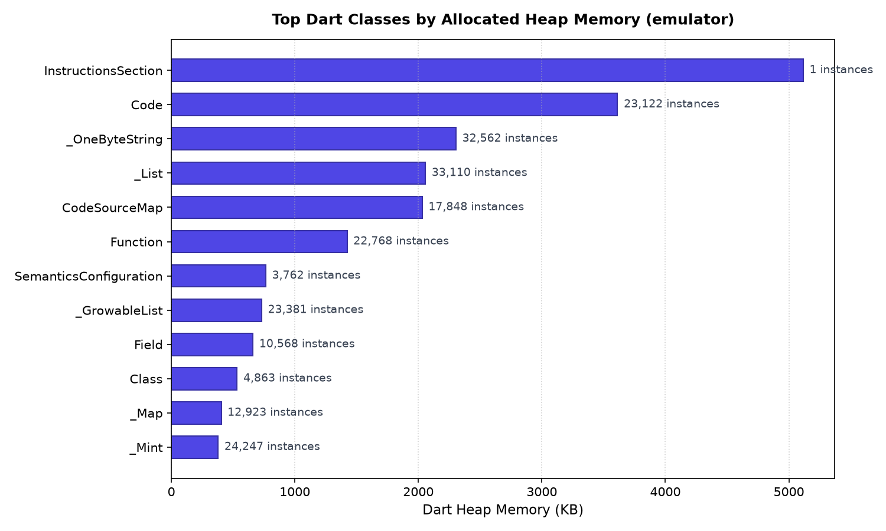

# Automated Performance and Footprint Benchmark Report

- **Generated At:** 2026-08-19 21:08:48
- **Application Package:** `app.phial.habits`
- **Target Device:** `sdk_gphone64_arm64` (`Android 16`, `1080x2400`, Serial: `emulator-5554`)
- **Report Identifier / Tag:** `emulator`

## Executive Summary

| Metric | Baseline | Peak | Resting | Delta (Post-GC) | Health Status |
| :--- | :--- | :--- | :--- | :--- | :--- |
| **Total System RAM (PSS)** | 142.8 MB | 144.3 MB | 142.1 MB | -0.7 MB | **STABLE** |
| **Native Heap (Impeller/C++)** | 21.4 MB | - | 20.0 MB | -1.4 MB | **OPTIMAL** |
| **Dart VM Heap** | 21.1 MB | - | 20.6 MB | -0.4 MB | **OPTIMAL** |

## CPU Utilization

- **Average Active CPU:** 12.6%
- **Peak CPU Spike:** 20.0%

## Frame Rate and Rendering Performance

| Rendering Metric | Measurement | Target / Budget | Status |
| :--- | :--- | :--- | :--- |
| **Total Frames Rendered** | 1,388 | - | COMPLETED |
| **Active Motion Render Rate** | **120.0 FPS** | 60.0 / 120.0 FPS | **OPTIMAL** |
| **Frame Smoothness / Fluidity** | **86.7%** | > 95.0% | **WARN** |
| **Janky Frames (>16.6ms)** | 185 (13.3%) | < 5.0% | **WARN** |
| **UI Thread Build Time (Avg)** | 0.4 ms (95th: 1.1ms) | < 8.0 ms | **OPTIMAL** |
| **Raster GPU Time (Avg)** | 4.0 ms (95th: 16.9ms) | < 8.0 ms | **OPTIMAL** |
| **Total Frame Time (Avg)** | 7.0 ms (99th: 43.1ms) | < 16.6 ms | **OPTIMAL** |

## Performance Timeline

## Dart Heap Class Allocations

| Class Name | Active Instances | Memory Allocated (KB) |
| :--- | :--- | :--- |
| `InstructionsSection` | 1 | 5116.1 KB |
| `Code` | 23,122 | 3612.8 KB |
| `_OneByteString` | 32,562 | 2304.5 KB |
| `_List` | 33,110 | 2056.9 KB |
| `CodeSourceMap` | 17,848 | 2030.8 KB |
| `Function` | 22,768 | 1423.0 KB |
| `SemanticsConfiguration` | 3,762 | 764.2 KB |
| `_GrowableList` | 23,381 | 730.7 KB |
| `Field` | 10,568 | 660.5 KB |
| `Class` | 4,863 | 531.9 KB |
| `_Map` | 12,923 | 403.8 KB |
| `_Mint` | 24,247 | 378.9 KB |

