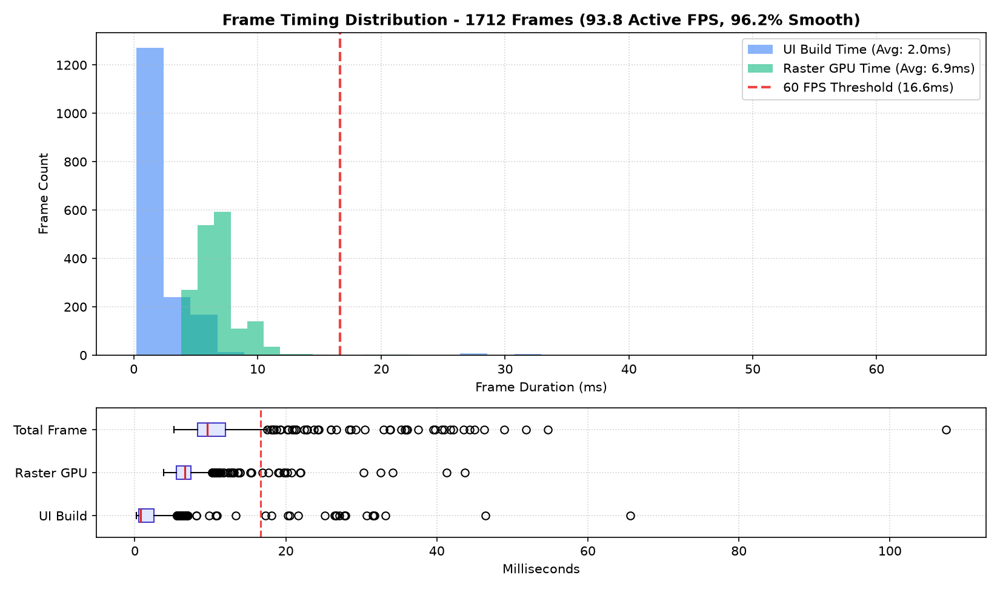
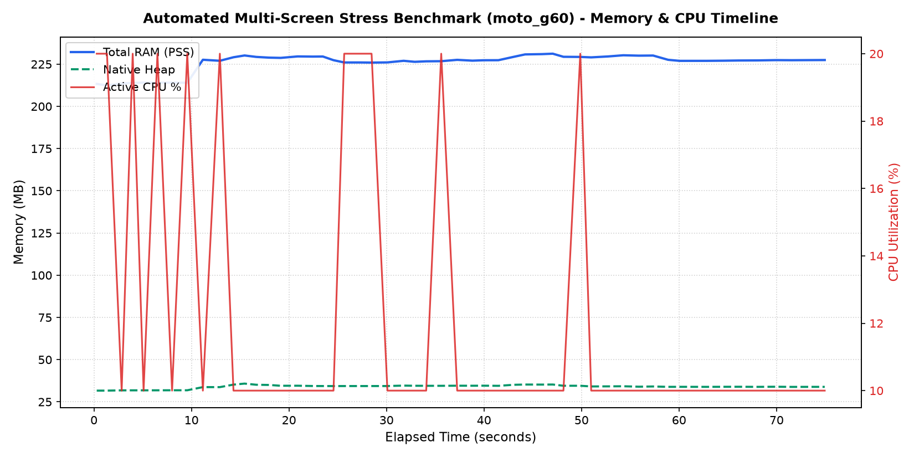
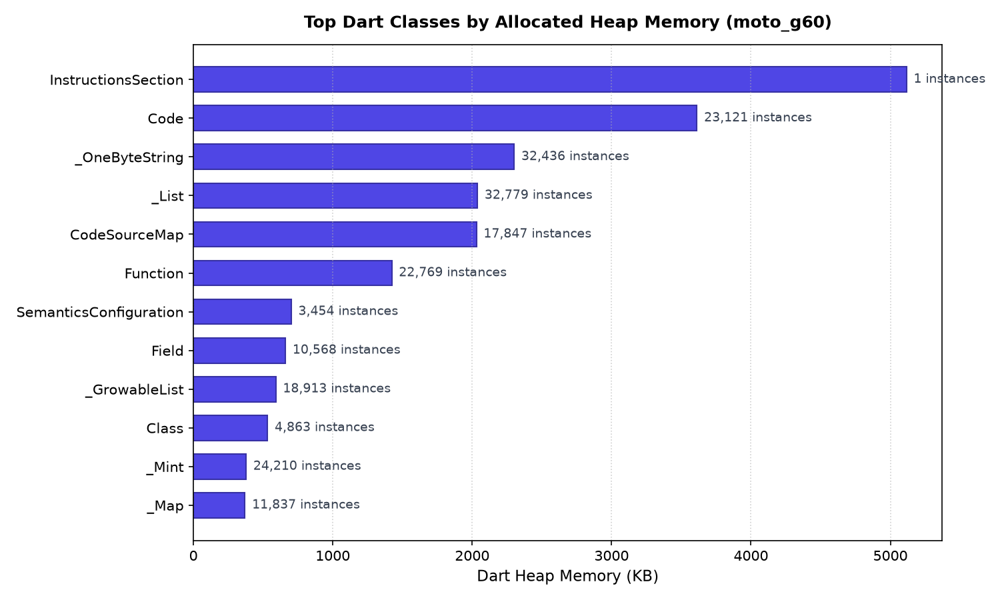

# Automated Performance and Footprint Benchmark Report

- **Generated At:** 2026-08-19 21:07:18
- **Application Package:** `app.phial.habits`
- **Target Device:** `moto g(60)` (`Android 12`, `1080x2460`, Serial: `ZD2224QRJY`)
- **Report Identifier / Tag:** `moto_g60`

## Executive Summary

| Metric | Baseline | Peak | Resting | Delta (Post-GC) | Health Status |
| :--- | :--- | :--- | :--- | :--- | :--- |
| **Total System RAM (PSS)** | 220.1 MB | 231.2 MB | 227.6 MB | +7.5 MB | **STABLE** |
| **Native Heap (Impeller/C++)** | 31.7 MB | - | 34.2 MB | +2.4 MB | **OPTIMAL** |
| **Dart VM Heap** | 21.1 MB | - | 19.8 MB | -1.3 MB | **OPTIMAL** |

## CPU Utilization

- **Average Active CPU:** 12.1%
- **Peak CPU Spike:** 20.0%

## Frame Rate and Rendering Performance

| Rendering Metric | Measurement | Target / Budget | Status |
| :--- | :--- | :--- | :--- |
| **Total Frames Rendered** | 1,712 | - | COMPLETED |
| **Active Motion Render Rate** | **93.8 FPS** | 60.0 / 120.0 FPS | **OPTIMAL** |
| **Frame Smoothness / Fluidity** | **96.2%** | > 95.0% | **PASS** |
| **Janky Frames (>16.6ms)** | 65 (3.8%) | < 5.0% | **PASS** |
| **UI Thread Build Time (Avg)** | 2.0 ms (95th: 6.0ms) | < 8.0 ms | **OPTIMAL** |
| **Raster GPU Time (Avg)** | 6.9 ms (95th: 10.2ms) | < 8.0 ms | **OPTIMAL** |
| **Total Frame Time (Avg)** | 10.7 ms (99th: 36.0ms) | < 16.6 ms | **OPTIMAL** |

## Performance Timeline

## Dart Heap Class Allocations

| Class Name | Active Instances | Memory Allocated (KB) |
| :--- | :--- | :--- |
| `InstructionsSection` | 1 | 5116.0 KB |
| `Code` | 23,121 | 3612.7 KB |
| `_OneByteString` | 32,436 | 2301.4 KB |
| `_List` | 32,779 | 2037.8 KB |
| `CodeSourceMap` | 17,847 | 2030.7 KB |
| `Function` | 22,769 | 1423.1 KB |
| `SemanticsConfiguration` | 3,454 | 701.6 KB |
| `Field` | 10,568 | 660.5 KB |
| `_GrowableList` | 18,913 | 591.0 KB |
| `Class` | 4,863 | 531.9 KB |
| `_Mint` | 24,210 | 378.3 KB |
| `_Map` | 11,837 | 369.9 KB |

